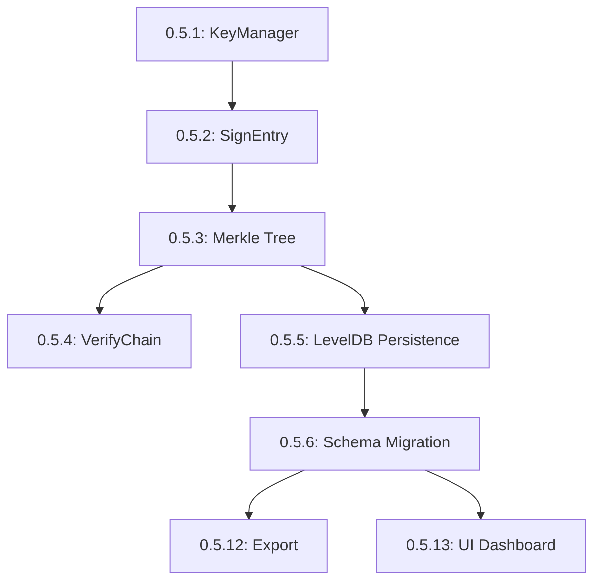
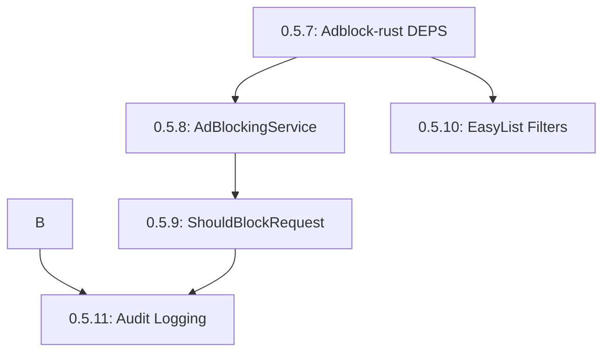

# Phase 0.5 Development Roadmap - Ready for Dev Team

**Version:** 1.0
**Date:** 2025-10-18
**Status:** Ready for Development
**Total Effort:** ~47 days (across team)

---

## Executive Summary

Phase 0.5 introduces **cryptographically verifiable privacy** with real audit trails and ad blocking. This phase transforms TypeScript mocks into production-grade C++ implementations.

**Key Deliverables:**
- Architectural foundation with Mojo IPC interfaces (ADR-009)
- Ed25519-signed audit logs with Merkle tree integrity
- LevelDB persistence for tamper-proof storage
- Brave's adblock-rust integration with 95%+ blocking rate
- 100% audit coverage for all privacy operations
- Performance test infrastructure (optional)

---

## Development Workflow Overview

### Sequential Dependencies (Critical Path)

### Parallel Work Opportunities

---

## Story Details & Assignments

### Week 1: Architectural Foundation

#### 🚀 **READY TO START** - Can begin immediately
**Story 0.5.0**: Chromium Integration Architecture Spike
- **Owner:** Lead Engineer
- **Priority:** P0 (Foundation)
- **Effort:** 2 days
- **Dependencies:** None
- **Deliverables:** ADR-009, Mojo IPC interfaces

### Week 1-2: Real Audit Trail (Crypto Foundation)

#### ⏳ **DEPENDS: Story 0.5.0**
**Story 0.5.1**: BoringSSL Integration - Generate Keypairs
- **Owner:** Crypto Engineer
- **Priority:** P0 (Foundation)
- **Effort:** 3 days
- **Dependencies:** Story 0.5.0 (architecture guidance)
- **Deliverables:** KeyManager class, key lifecycle management

#### ⏳ **DEPENDS: 0.5.1**
**Story 0.5.2**: BoringSSL Integration - Implement SignEntry() Method
- **Owner:** Crypto Engineer
- **Priority:** P0 (Foundation)
- **Effort:** 2 days
- **Dependencies:** Story 0.5.1
- **Deliverables:** AuditLogger::SignEntry(), signature verification

#### ⏳ **DEPENDS: 0.5.2**
**Story 0.5.3**: Merkle Tree Implementation - Build Merkle Tree
- **Owner:** Crypto Engineer
- **Priority:** P0 (Foundation)
- **Effort:** 4 days
- **Dependencies:** Story 0.5.2
- **Deliverables:** MerkleTree class, SHA-256 hashing, root calculation

#### ⏳ **DEPENDS: 0.5.3**
**Story 0.5.4**: Merkle Tree Implementation - VerifyChain() Method
- **Owner:** Crypto Engineer
- **Priority:** P0 (Foundation)
- **Effort:** 3 days
- **Dependencies:** Story 0.5.3
- **Deliverables:** AuditLogger::VerifyChain(), tamper detection

### Week 3-4: Ad Blocking MVP (Parallel to Crypto)

#### 🚀 **READY TO START** - Can run parallel to crypto work
**Story 0.5.7**: Adblock-rust Integration - Add Dependency to DEPS
- **Owner:** Build Engineer
- **Priority:** P0 (Foundation)
- **Effort:** 2 days
- **Dependencies:** None (parallel to crypto)
- **Deliverables:** DEPS configuration, build integration

#### ⏳ **DEPENDS: 0.5.7**
**Story 0.5.8**: Adblock-rust Integration - Wrap in AdBlockingService
- **Owner:** Network Engineer
- **Priority:** P0 (Foundation)
- **Effort:** 4 days
- **Dependencies:** Story 0.5.7
- **Deliverables:** AdBlockingService class, network interception

#### 🚀 **READY TO START** - Can run parallel to 0.5.8
**Story 0.5.10**: EasyList Filters - Download and Parse Filters
- **Owner:** Network Engineer
- **Priority:** P0 (Foundation)
- **Effort:** 3 days
- **Dependencies:** None (parallel to service work)
- **Deliverables:** FilterManager, EasyList/uBlock parsing

#### ⏳ **DEPENDS: 0.5.8**
**Story 0.5.9**: Adblock-rust Integration - ShouldBlockRequest Method
- **Owner:** Network Engineer
- **Priority:** P0 (Foundation)
- **Effort:** 3 days
- **Dependencies:** Story 0.5.8
- **Deliverables:** Blocking logic, performance optimization

### Integration & Persistence

#### ⏳ **DEPENDS: 0.5.3**
**Story 0.5.5**: LevelDB Persistence - Replace In-Memory Arrays
- **Owner:** Storage Engineer
- **Priority:** P0 (Foundation)
- **Effort:** 4 days
- **Dependencies:** Story 0.5.3 (Merkle Tree)
- **Deliverables:** AuditStorage class, LevelDB integration

#### ⏳ **DEPENDS: 0.5.5**
**Story 0.5.6**: LevelDB Persistence - Schema Versioning and Migration
- **Owner:** Storage Engineer
- **Priority:** P0 (Foundation)
- **Effort:** 3 days
- **Dependencies:** Story 0.5.5
- **Deliverables:** MigrationManager, schema versioning

#### ⏳ **DEPENDS: 0.5.2 + 0.5.9**
**Story 0.5.11**: Audit Logging Integration - Log Blocked Requests
- **Owner:** Integration Engineer
- **Priority:** P0 (Foundation)
- **Effort:** 3 days
- **Dependencies:** Story 0.5.2 (crypto) + Story 0.5.9 (blocking)
- **Deliverables:** Ad blocking audit integration, cryptographic proofs

### Enhancement Stories (Post-Core)

#### ⏳ **DEPENDS: 0.5.6**
**Story 0.5.12**: Audit Log Export Functionality
- **Owner:** UI/Backend Engineer
- **Priority:** P1 (Enhancement)
- **Effort:** 4 days
- **Dependencies:** Story 0.5.6
- **Deliverables:** JSON/CSV/PDF export, filtering

#### ⏳ **DEPENDS: 0.5.6 + 0.5.12**
**Story 0.5.13**: Transparency Dashboard UI Integration
- **Owner:** Frontend Engineer
- **Priority:** P1 (Enhancement)
- **Effort:** 5 days
- **Dependencies:** Story 0.5.6 + Story 0.5.12
- **Deliverables:** Real-time dashboard, audit viewer

#### 🔄 **OPTIONAL - Can run anytime**
**Story 0.5.14**: Performance Test Infrastructure
- **Owner:** DevOps Engineer
- **Priority:** P2 (Nice-to-have)
- **Effort:** 3 days
- **Dependencies:** None (independent)
- **Deliverables:** Performance benchmarking framework, regression detection

---

## Team Assignments & Timeline

### **Team Composition Recommendation:**
- **1x Lead Engineer** (Story 0.5.0 - architecture spike)
- **2x Crypto Engineers** (Stories 0.5.1-0.5.4)
- **2x Network Engineers** (Stories 0.5.7-0.5.11)
- **1x Storage Engineer** (Stories 0.5.5-0.5.6)
- **1x Integration Engineer** (Story 0.5.11)
- **1x UI Engineer** (Stories 0.5.12-0.5.13)
- **1x DevOps Engineer** (Story 0.5.14 - optional)

### **Timeline (4 weeks):**

**Week 1:**
- Start: 0.5.0 (architecture), 0.5.1, 0.5.7, 0.5.10 (parallel)
- Complete: 0.5.0, 0.5.1, 0.5.7
- Start: 0.5.2, 0.5.8

**Week 2:**
- Complete: 0.5.2, 0.5.10, 0.5.8
- Start: 0.5.3, 0.5.9, 0.5.5

**Week 3:**
- Complete: 0.5.3, 0.5.9, 0.5.5
- Start: 0.5.4, 0.5.6, 0.5.11

**Week 4:**
- Complete: 0.5.4, 0.5.6, 0.5.11
- Start: 0.5.12, 0.5.13

---

## Phase 1 Parallel Opportunities

Phase 0.5 can run **parallel to Phase 1** work where dependencies allow:

### **Phase 1 Stories Ready for Parallel Development:**

**Story 1.2**: Chromium Fork Setup Documentation *(Draft)*
- Can run parallel to Phase 0.5
- Dependencies: None
- Owner: DevOps/Technical Writer

**Story 1.3**: C++ Implementation *(Blocked)*
- Blocked by Story 1.2 completion
- Cannot start until Phase 0.5 crypto foundation complete

### **Safe Parallel Work:**
- Phase 0.5 crypto work (0.5.1-0.5.4) can run parallel to Phase 1 documentation
- Phase 0.5 ad blocking work (0.5.7-0.5.10) can run parallel to Phase 1
- Phase 0.5 integration (0.5.11) depends on both phases' completion

---

## Quality Gates & Success Criteria

### **Per-Story Quality Gates:**
- [ ] **Code Review**: 2+ approvals required
- [ ] **Unit Tests**: 80%+ coverage, all tests passing
- [ ] **Integration Tests**: End-to-end functionality verified
- [ ] **Performance**: Meets requirements (<5ms ad blocking, <10ms crypto)
- [ ] **Security**: No vulnerabilities, cryptographic correctness verified
- [ ] **Documentation**: Implementation docs updated

### **Phase Quality Gates:**
- [ ] **Cryptographic Verification**: All signatures verifiable with OpenSSL
- [ ] **Ad Blocking Effectiveness**: 95%+ block rate vs. top 100 sites
- [ ] **Audit Integrity**: 100% coverage, Merkle tree verification working
- [ ] **Performance**: No regression vs. current baseline
- [ ] **Security Audit**: Third-party review of crypto implementation

---

## Risk Mitigation

### **Critical Risks:**
1. **Cryptographic Implementation**: Pair program crypto code, external security review
2. **Build System Complexity**: Daily integration testing, rollback plans
3. **Performance Regression**: Continuous benchmarking, performance budgets
4. **Rust/C++ Interop**: Comprehensive testing, memory safety validation

### **Contingency Plans:**
- **Crypto Issues**: Fallback to known-good implementations
- **Build Failures**: Incremental rollout, feature flags for rollback
- **Performance Issues**: Optimization sprints, caching strategies
- **Timeline Slip**: Parallel work opportunities identified

---

## Success Metrics

- **Code Quality**: 0 ESLint/TypeScript errors, 80%+ test coverage
- **Performance**: <5ms ad blocking latency, <10ms crypto operations
- **Security**: 0 crypto vulnerabilities, 100% audit coverage
- **Integration**: Clean builds on all platforms, zero regressions
- **User Impact**: Mathematically verifiable privacy promises delivered

---

**Ready for Development Kickoff Meeting!** 🚀

*Next: Schedule team alignment meeting to assign stories and establish daily standups.*
